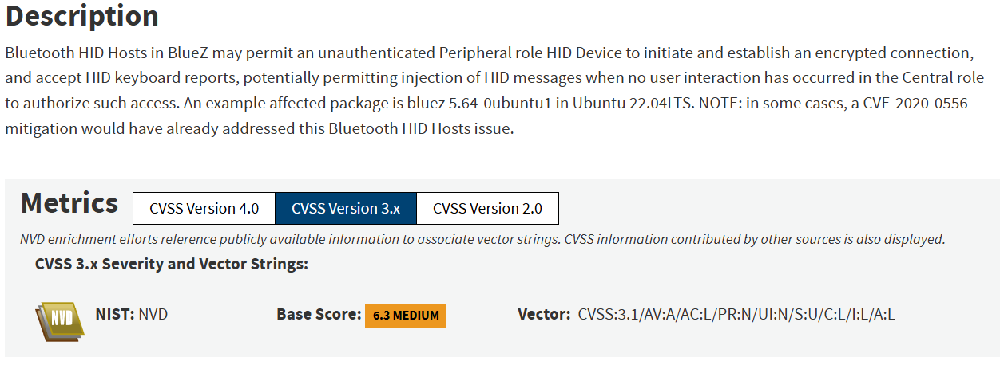
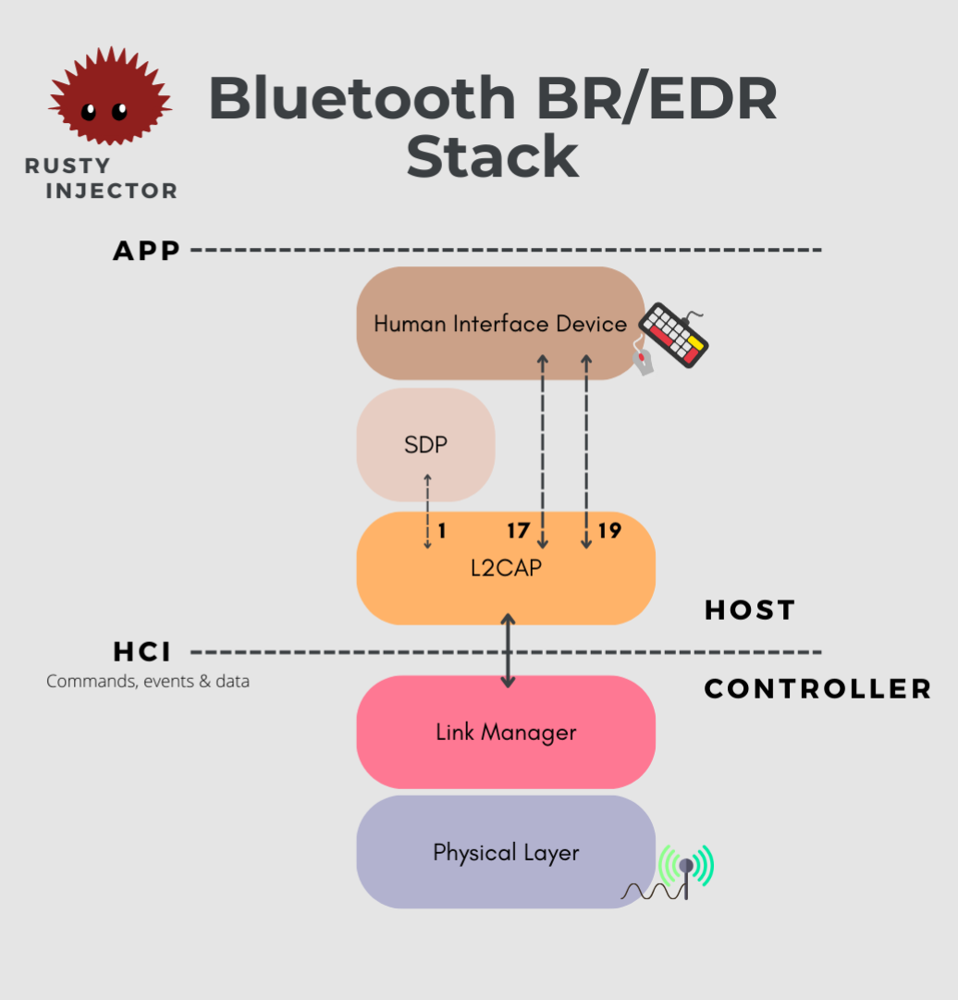
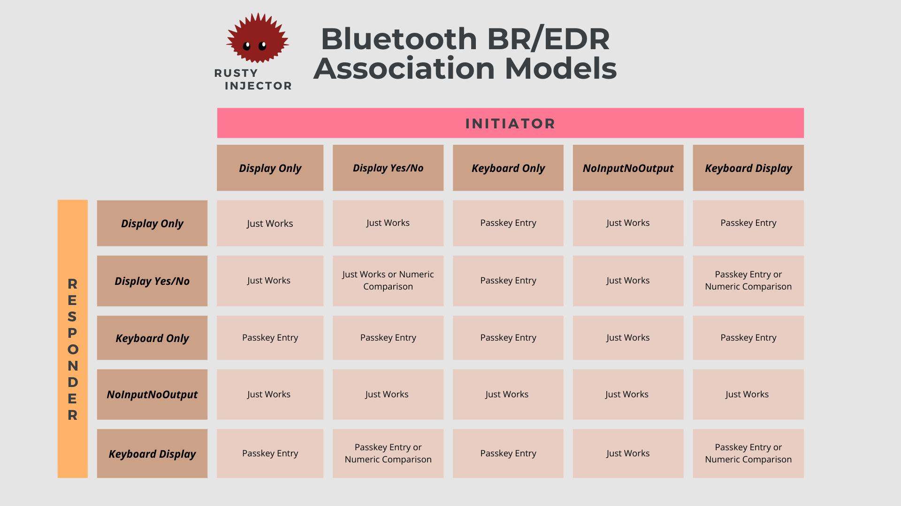
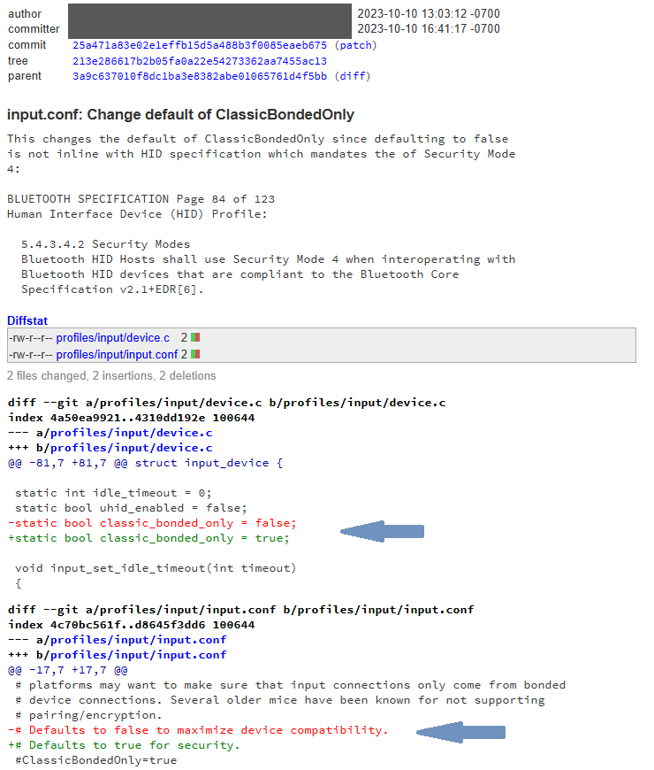
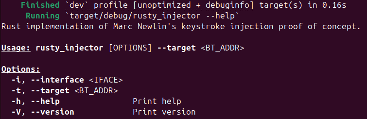

⚠️ ***Disclaimer: For Research and Educational Purposes Only**  
This project is a Proof of Concept (PoC) demonstrating Bluetooth keystroke injection, re-implemented in Rust. It is intended strictly for educational and security research purposes.*

- *Do not use this code to compromise systems without explicit authorization*.
- *Any unauthorized, illegal, or unethical use of this project is strictly prohibited.*
- *The author assumes no responsibility for misuse or damage caused by this code.*

*By downloading, cloning, or using this code, you agree to use it responsibly and in compliance with all applicable laws and regulations.*

* * *

## 🦀 Rusty Injector !

<p align="center">

</p>

Welcome to **Rusty Injector** — a Rust implementation inspired by Marc Newlin's [Bluetooth keystroke injection PoC](https://github.com/marcnewlin/hi_my_name_is_keyboard), linked to **CVE-2023-45866**, **CVE-2024-21306**, and **CVE-2024-0230**.

Currently, this repository only implements CVE-2023-45866, which exploits keystroke injection vulnerabilities in **BlueZ** on the **Linux** operating system.

*Below is a screenshot of the NIST description, including the CVSS scoring :*  
<p align="center">

</p>

**Capture 1** : NIST description of CVE-2023-45866.

The other CVEs, CVE-2024-21306 and CVE-2024-0230, **are not planned for implementation by myself**, but contributions are warmly welcomed.

### 1\. How does it work ?

*Before getting into any details, I encourage you to watch Marc Newlin's presentation at the NullCon 2024 Conference, as it offers a clear and thorough explanation of these vulnerabilities : [Hi, My Name Is keyboard by Marc Newlin.](https://www.youtube.com/watch?v=Nj7Qj3-_nQg&ab_channel=nullcon)*.  
*I've also made available a video that popularizes this vulnerability. You'll find it right here : Marc Newlin's Bluetooth Keystroke Injection (Would be uploaded soon)*.

📌 If you notice any missing points, areas that could be better simplified, or potential mistakes in the explanation below, please feel free to modify it and submit a merge request. I would be delighted to review your contributions and incorporate them into the repository.

As we have only covered CVE-2023-45866 vulnerability standing for Linux operating systems, we would only explain the process to reach this specific exploitation targeting the BlueZ library.

First of all, you must understand that this vulnerability **is only exploitable on Bluetooth BR/EDR** because it is targeting the HID profile standing upon this technology. You may know that the bluetooth architectural implementation is divided into multiple layers such as the OSI model for the ethernet protocol, and as you can observe it on our schematic below.

<p align="center">

</p>

**Diagram 1** : Simplified Bluetooth BR/EDR (Basic Rate - Enhanced Data Rate) stack. *The lowest layer of the stack represents the physical layer with a dedicated antenna, and the higher level stands for the application level or that we can sometimes designate as the operating system. When two devices want to communicate with eachother, they go through these different layers : from up to bottom for outgoing packets and bottom to up for incoming bluetooth packets.*

After the inquiry process, once the devices determine that they want to establish a connection, they proceed to the pairing process. This process enables mutual authentication between the devices and the establishment of an encryption key, which is then used to secure the communication.

The Bluetooth specification offers different levels of authentication and security. Depending on the mechanism used for authentication, the level of security for the communication may vary. Devices can authenticate based on the input and output peripherals they possess, a concept referred to as association models. *You have likely encountered this when pairing two devices—such as being asked to enter a PIN code displayed on the other device*.

There are four pairing association models, determined by the devices' I/O (Input/Output) capabilities:

- Just Works (Unauthenticated)
- Numeric Comparison (Authenticated)
- Passkey Entry (Authenticated)
- Out of Band (Authenticated) – Relies on another technology to facilitate the pairing process.

Below is a table showing which association model is used based on the capabilities of our IoT devices.

<p align="center">

</p>

**Diagram 2** : Table illustrating Bluetooth BR/EDR association models inspired by the Bluetooth Core Specification v5.3 - 2.3.5.1 Selecting key generation method Table 2.8 : Mapping of IO cacpabilities to key generation method (page 1573). *For more information on security modes and association models, please check this interresting blog post published by Thyrasec : [Bluetooth Security : Classic & BLE](https://www.thyrasec.com/blog/bluetooth-security-primer-classic-ble/) !*

I’m confident you’re intrigued by the 'Just Works' method, which is precisely where our vulnerability lies. Here’s the issue: this method establishes pairing without requiring user confirmation or interaction, leaving no way to verify the authenticity of the pairing device. On Linux systems, the BlueZ stack, by default, accepted incoming pairing requests from devices classified as NoInputNoOutput (to enable backward compatibility). A truly "wonderful" design choice, wouldn’t you agree?

<p align="center">

</p>

**Capture 2** : Update of the default configuration of blueZ to enable bluetooth security and patch CVE-2023-45866.

After pairing with the target device, our system establishes a connection to the Service Discovery Protocol (SDP) through port 1 of the L2CAP layer. As shown in Diagram 1, the L2CAP layer serves as an intermediary between the lower and upper service layers, providing segmentation, multiplexing, and reassembly of data packets. Through the SDP connection, we identify all available services on the target device and connect to the Human Interface Profile (HID) service. The HID profile, used by operating systems to process input from Bluetooth keyboards and mice, operates via ports 17 (HID Control) and 19 (HID Interrupt) of the L2CAP layer. To access the HID profile, no authentification is required and any device connected to port 17 and 19 of the L2CAP is recognized as an HID device.

An attacker can impersonate the services and device class of a Bluetooth wireless keyboard, exploit the 'Just Works' association model by specifying a 'NoInputNoOutput' capability, and inject unauthorized keystrokes into the target device.

### 2\. How was it implemented ?

To be completely honest, the sole objective was to reimplement the proof of concept in Rust to gain a deeper understanding of the insights of this exploit. That's why in this first iteration, the global architecture was inspired by python PoC of Marc Newlin : [Github "hi_my_name_is_keyboard"](https://github.com/marcnewlin/hi_my_name_is_keyboard). In a future rework, it could be implemented in a more rusty manner.

Crates (= Rust Libraries) used during this implementation :

```toml
[dependencies]
bluer = { version = "0.17.3", features = ["l2cap", "bluetoothd", "id", "rfcomm"] }
tokio = "1.42.0"
regex = "1.11.1"
clap = { version = "4.5.23", features = ["derive"] }
```

The key dependency in my project was 'BlueR,' a Rust API built on top of the original BlueZ C library. You can check out their work here : [GitHub BlueR](https://github.com/bluez/bluer). I also integrated Tokio to enable the use of the `async` functions provided by the BlueR library. Additionally, I utilized Clap, a command-line argument parser, and Regex, a crate that implements regular expressions in Rust, to validate user inputs for the 'bt_addr' (Bluetooth Address).

After observation of Marc Newlin's implementation, I decomposed the architecture in several steps to replicate the same functionnality :

1. Parse user arguments which are used to get :
	- `--iface` or `-i` which stands for the bluetooth interface/adapter to use. This argument is optional, if nothing is specified, it would try to reach a default one.
	- `--target` or `-t` which is **mandatory** and specifies the bluetooth address of the target.
2. Deploy a bluetooth agent with `NoInputNoOutput` capabilities to be able to access the "Just Works" pairing method during the connection with the target device.
3. Register a profile with HID keyboard services and register the class `0x002540` to impersonate a keyboard.
4. Create all the enums and functions to convert our inputs to the right HID bytes that would be sended in HID packets.
5. Launch connections to the right ports on the L2CAP layer (Port 1 - SDP, Port 17 - HID Control & Port 19 - HID Interrupt) and inject illegitimate keystrokes.

I've attempted to comment my code as much as possible. If you go through it, you would easily recognize all these steps. 
*To make it more elegant, the next step would be to make it more rusty, have a graceful termination and add several other functionalities like the capability of parsing keyboard scripts (prepared payloads) or having a graphical user interface. Once again, this was only for educational purposes, I'm not sure of working on other iteration of this program. But once again, contributions are warmly welcomed. If you have any questions, don't hesitate to ask*.

### 3\. How to use ?

First thing to note : This tool was **developped and tested on Ubuntu 24.04**.

To use this tool, you need to disable the default HID service registered by BlueZ, so it can be re-registered when launching the exploit. Follow these steps:

- Edit `/etc/systemd/system/bluetooth.target.wants/bluetooth.service` configuration file
- Modify the line :
`ExecStart=/usr/libexec/bluetooth/bluetoothd`
By the following one :
`ExecStart=/usr/libexec/bluetooth/bluetoothd --noplugin=input`
- After modifying the file, you need to reload the systemd configuration and restart the Bluetooth service to apply the changes.
`sudo systemctl daemon-reload`
`sudo systemctl restart bluetooth`


 Now you simply need to pull the project and execute it by building it with `cargo build` or running it directly by specyfing the arguments with : 
 `cargo run -- -i [BT_INTERFACE] -t [BT_TARGET]`.

<p align="center">

</p>

**Capture 3** : Command line interface of Rusty Injector.

 Here is an example : 
 `cargo run -- -i hci0 -t AA:BB:CC:DD:EE:FF`

 Another thing to note is that if you want to modify the code and make usage of the "set_address" function through the `Configuration` trait, you must install the tool bdaddr to be able use it :
 ```shell
 # build bdaddr from the bluez source
cd ~/
git clone --depth=1 https://github.com/bluez/bluez.git
gcc -o bdaddr ~/bluez/tools/bdaddr.c ~/bluez/src/oui.c -I ~/bluez -lbluetooth
sudo cp bdaddr /usr/local/bin/
```

Please note, if you don't specify any bluetooth interface, it would attempt to reach a default one. And **OBVIOUSLY**, don't forget to plug a bluetooth interface to your Ubuntu operating system.🙃

***

I believe I've covered everything—you're now ready to make the most of Rusty Injector! If you encounter any issues or have comments or feedback, feel free to open an issue. Have an amazing experience and happy hacking! 🚀